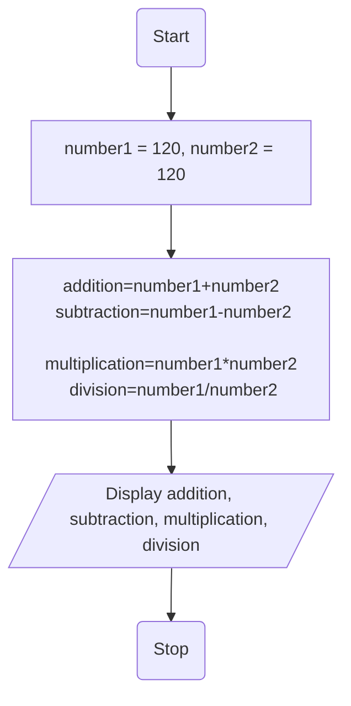
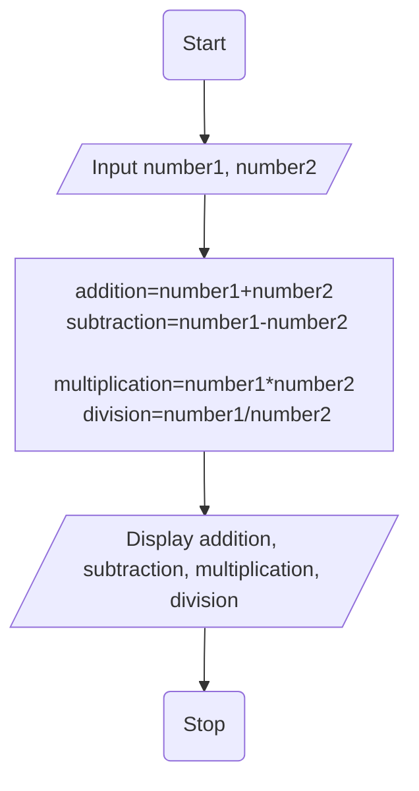

# Java Fundamentals Exercise

## Prerequisites
- Java must be installed.
- Verify installation using the following commands:

```bash
    java -version
    javac -version
```

## Clone repository or Run in GitHub Codespaces
- Clone the repository:
```bash
    git clone https://github.com/jayani-athukorala/java-fundamentals-exercise.git
    cd java-fundamentals-exercise
```
- Open GitHub Codespaces in the repository:

Code → Open with Codespaces → New codespace


## Compile programs
- This will compile all .java files and create .class files in the same directory.
```bash
    javac *.java
```

## Run programs
- Run a specific program using following commands.
```bash
    java Q1
    java Q2 ...etc
```
### ...and so on

-- 

# Pseudocodes and Flowcharts for each Exercises

## 1

### Pseudocode

```text
BEGIN
    SET name = "Jayani"
    PRINT "Hello,\n",name,"!"
END
```
### Flowchart

```mermaid
flowchar TD
    A(Start) --> B[name="Jayani"]
    B --> C[/Display "Hello,\n",Jayani,"!"/]
    C --> D(Stop)
```
---

# 2
### Pseudocode
```text
BEGIN
    INPUT year
    IF year % 4 == 0 AND NOT(year % 100 == 0 AND NOT(year % 400 == 0)) THEN
        PRINT "A leap year"
    ELSE
        PRINT "Not a leap year"
    END IF
END
```

### Flowchart
```mermaid
flowchart TD
    A(Start) --> B[/Input year/]
    B --> C{year % 4 == 0 AND NOT(year % 100 == 0 AND NOT(year % 400 == 0))}
    C -- Yes --> D[/Display "A leap year"/]
    C -- No --> E[/Display "Not a leap year"/]
    D --> F(Stop)
    E --> F
```
---

# 3
### Pseudocode
```text
BEGIN
    SET number1 = 120, number2 = 12
    addition = number1+number2
    subtraction = number1 - number2
    multiplication = number1 * number2
    division = number1 / number2
    PRINT addition, subtraction, multiplication, division
END
```
### Flowchart

---

# 4
### Pseudocode
```text
BEGIN
    SET count = 1, num_of_times = 3, sum = 0
    WHILE count <= num_of_times DO
        INPUT number
        sum = sum + number
        count = count + 1
    END WHILE
    average = sum / num_of_times
    PRINT average 
END
```

### Flowchart
```mermaid
flowchart TD
    A(Start) --> B[count = 1<br>num_of_times = 3<br>sum = 0]
    B -> C{While<br>count <= num_of_times}
    C -- Yes --> D[/Input Number/]
    D --> E[sum = sum + number]
    E --> F[count = count + 1]
    F --> C
    C -- No --> G[average = sum/num_of_times]
    G --> H[/Display Average/]
    H --> I(Stop)

```
---

# 5
### Pseudocode

```text
BEGIN
    INPUT name
    PRINT "Hello, ",name,"!"
END
```
### Flowchart

```mermaid
flowchar TD
    A(Start) --> B[/Input name]
    B --> C[/Display "Hello, ",name,"!"/]
    C --> D(Stop)
```
---

# 6
### Pseudocode
```text
BEGIN
    INPUT number1, number2
    addition = number1+number2
    subtraction = number1 - number2
    multiplication = number1 * number2
    division = number1 / number2
    PRINT addition, subtraction, multiplication, division
END
```
### Flowchart

---

# 7
### Pseudocode

### Flowchart

---

# 8

### Pseudocode

### Flowchart

---