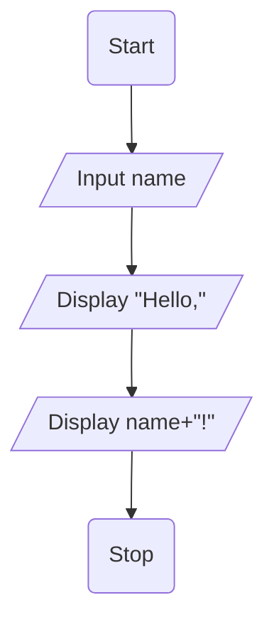
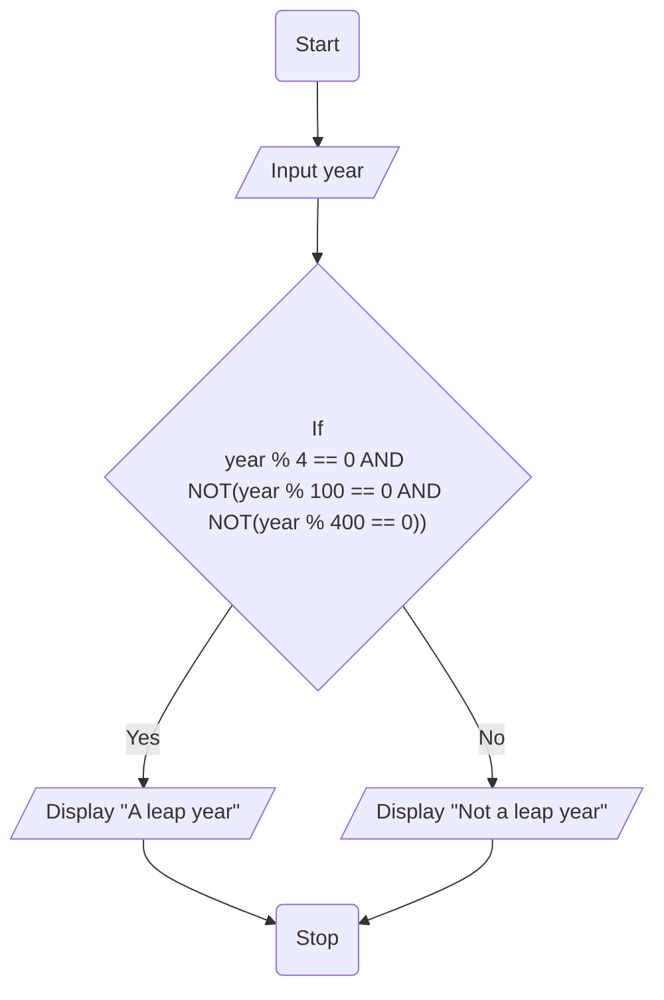
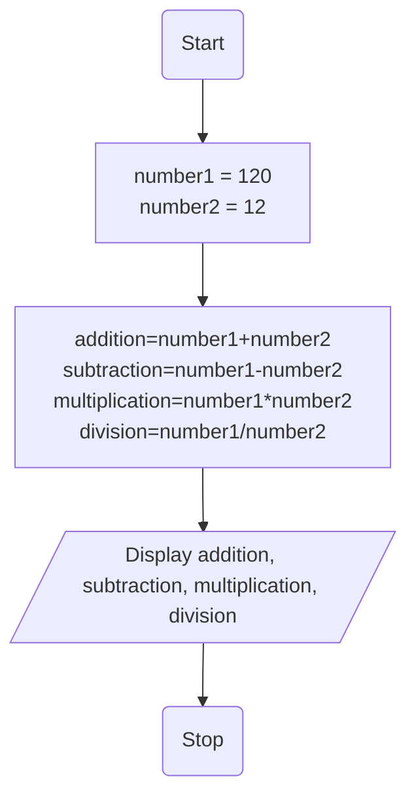
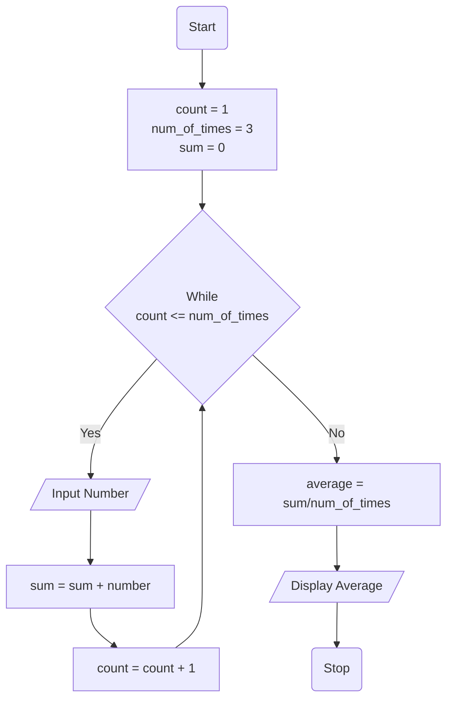
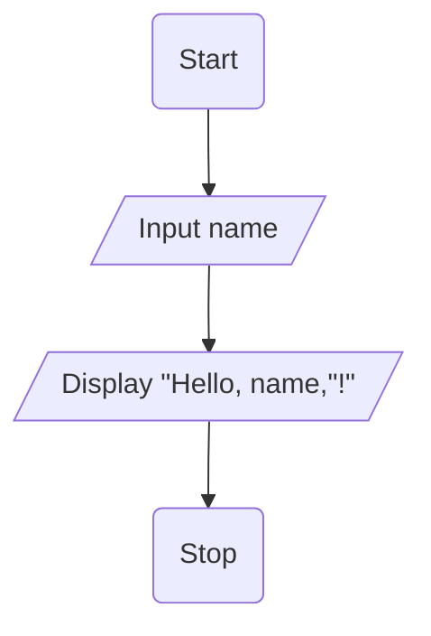
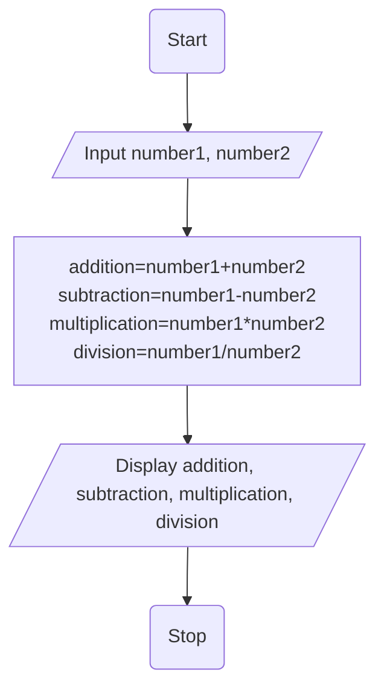
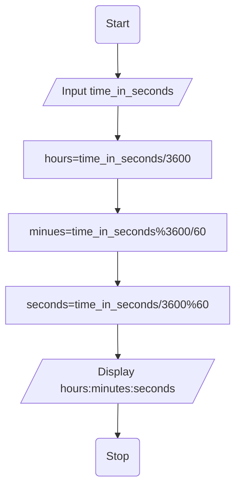
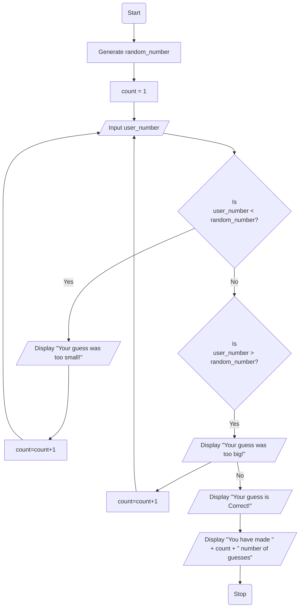

# Java Fundamentals Exercise

## Prerequisites
- Java must be installed.
- Verify installation using the following commands:

```bash
    java -version
    javac -version
```

## Clone repository or Run in GitHub Codespaces
- Clone the repository:
```bash
    git clone https://github.com/jayani-athukorala/java-fundamentals-exercise.git
    cd java-fundamentals-exercise
```
- Open GitHub Codespaces in the repository:

Code → Open with Codespaces → New codespace


## Compile programs
- This will compile all .java files and create .class files in the same directory.
```bash
    javac *.java
```

## Run programs
- Run a specific program using following commands.
```bash
    java Q1
    java Q2 ...etc
```
### ...and so on

---

# Pseudocodes and Flowcharts

## 1. Print 'Hello' and name on screen (in separate lines)

### Pseudocode

```text
BEGIN
    SET name = "Jayani"
    PRINT "Hello,"
    PRINT name
END
```
### Flowchart

---

# 2. Print if a year (User input) is leap or not.
### Pseudocode
```text
BEGIN
    INPUT year
    IF year % 4 == 0 AND NOT(year % 100 == 0 AND NOT(year % 400 == 0)) THEN
        PRINT "A leap year"
    ELSE
        PRINT "Not a leap year"
    END IF
END
```

### Flowchart

---

# 3. Print the sum/multiplication/division and subtraction of two numbers
### Pseudocode
```text
BEGIN
    SET number1 = 120, number2 = 12
    addition = number1+number2
    subtraction = number1 - number2
    multiplication = number1 * number2
    division = number1 / number2
    PRINT addition, subtraction, multiplication, division
END
```
### Flowchart

---

# 4. Prints the average of three numbers
### Pseudocode
```text
BEGIN
    SET count = 1, num_of_times = 3, sum = 0
    WHILE count <= num_of_times DO
        INPUT number
        sum = sum + number
        count = count + 1
    END WHILE
    average = sum / num_of_times
    PRINT average 
END
```

### Flowchart

---

# 5. Print ‘Hello username’ where username get as a user input.
### Pseudocode

```text
BEGIN
    INPUT name
    PRINT "Hello, " + name + "!"
END
```

### Flowchart

---

# 6. Print the sum/multiplication/division and subtraction of given numbers (User inputs).
### Pseudocode
```text
BEGIN
    INPUT number1, number2
    addition = number1+number2
    subtraction = number1 - number2
    multiplication = number1 * number2
    division = number1 / number2
    PRINT addition, subtraction, multiplication, division
END
```
### Flowchart

---

# 7. Convert seconds to hours, minutes and seconds
### Pseudocode
```text
BEGIN
    INPUT time_in_seconds
    hours = time_in_seconds/3600
    minues = time_in_seconds%3600/60
    seconds = time_in_seconds/3600%60
    PRINT hours:minutes:seconds
END
```

### Flowchart

---

# 8. Generates a random number and let the user to guess the generated number.

### Pseudocode
```text
BEGIN
    GENERATE random_number
    SET count = 1
    REPEAT
        Input user_number

        IF userNumber < randNumber THEN
            PRINT "Your guess was too small!"
            count++
        ELSE IF userNumber > randNumber THEN
            PRINT "Your guess was too big!"
            count++
        END IF
    UNTIL userNumber == random_number
    PRINT "Your guess is Correct!"
    PRINT "You have made " + count + " number of guesses"
END
```

### Flowchart


---